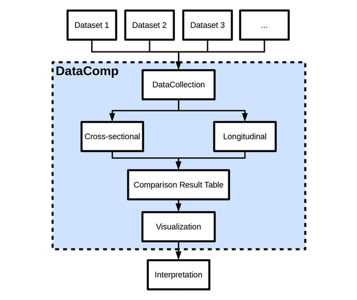

DataComp: A Python Framework for Systematic Dataset Comparisons
===============================================================

|pypi_version| |pypi_license| |python_versions| |documentation|

.. |pypi_license| image:: https://img.shields.io/pypi/l/datacomp.svg
    :alt: Apache 2.0 License

.. |python_versions| image:: https://img.shields.io/pypi/pyversions/datacomp.svg
    :alt: Stable Supported Python Versions

.. |pypi_version| image:: https://img.shields.io/pypi/v/datacomp.svg
    :alt: Current version on PyPI

.. |documentation| image:: https://readthedocs.org/projects/datacomp/badge/?version=latest
    :target: http://pybel.readthedocs.io/en/latest/
    :alt: Development Documentation Status

Description
-----------
DataComp is an open source Python package for domain independent multimodal longitudinal dataset comparisons.
It serves as an investigative toolbox to assess differences between multiple datasets on feature level.
DataComp empowers data analysts to identify significantly different and not significantly difference between datasets \
and thereby is helpful to identify comparable dataset combinations.

Typical application scenarios are:

- Identifying comparable datasets that can be used in machine learning approaches as training and independent test data
- Evaluate if, how and where simulated or synthetic datasets deviate from real world data
- Assess (systematic) differences across multiple datasets (for example multiple sampling sites)
- Conducting multiple statistical comparisons
- Comparative visualizations

The figure above depicts a typical DataComp workflow.

Main Features
=============
DataComp supports:

- Evaluating and visualizing the overlap in features across datasets
- Parametric and nonparametric statistical hypothesis testing to compare feature value distributions
- Creating comparative plots of feature value distributions
- Normalizing time series data to baseline and statistically comparing the progression of features over time
- Comparative visualization of feature progression over time
- Hierarchical clustering of the entities in the data sets to evaluate if dataset membership labels are evenly
  distributed across clusters or assigned to distinct clusters
- Performing a MANOVA to assess the influence of features onto the dataset membership

Installation
------------
.. code-block:: sh

   pip install datacomp

Documentation
-------------
The full package documentation can be found here_.

.. _here: https://datacomp.readthedocs.io/en/latest/

Application examples
~~~~~~~~~~~~~~~~~~~~
Example notebooks showcasing Datacomp workflows and results on simulated data can be found at DataComp_Examples_:

.. _DataComp_Examples:

- `Cross-sectional Comparison Example`_

.. _Cross-sectional Comparison Example: https://github.com/Cojabi/DataComp_Examples/blob/master/cross-sectional_example.ipynb

- `Longitudinal Comparison Example`_

.. _Longitudinal Comparison Example: https://github.com/Cojabi/DataComp_Examples/blob/master/longitudinal_example.ipynb
