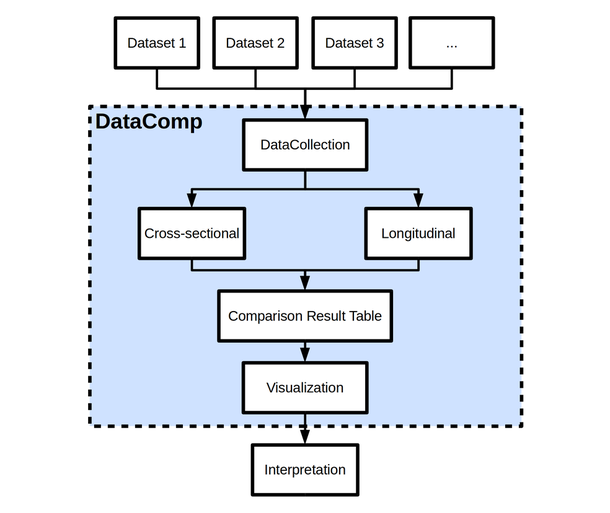

.. DataComp documentation master file, created by
   sphinx-quickstart on Thu Sep  6 15:45:33 2018.
   You can adapt this file completely to your liking, but it should at least
   contain the root `toctree` directive.

DataComp Documentation
======================

DataComp is an open source Python package for domain independent multimodal longitudinal dataset comparisons.
It serves as an investigative toolbox to assess differences between multiple datasets on feature level.
DataComp empowers data analysts to identify significantly different and not significantly difference between datasets \
and thereby is helpful to identify comparable dataset combinations.

Typical application scenarios are:

- Identifying comparable datasets that can be used in machine learning approaches as training and independent test data
- Evaluate if, how and where simulated or synthetic datasets deviate from real world data
- Assess differences across data from multiple sampling sites
- Conducting multiple statistical comparisons
- Comparative visualizations

This figure depicts a typical DataComp workflow.

Main Features
=============
DataComp supports:

- Evaluating and visualizing the overlap in features across datasets
- Parametric and nonparametric statistical hypothesis testing to compare feature value distributions
- Creating comparative plots of feature value distributions
- Normalizing time series data to baseline and statistically comparing the progression of features over time
- Comparative visualization of feature progression over time
- Hierarchical clustering of the entities in the data sets to evaluate if dataset membership labels are evenly
  distributed across clusters or assigned to distinct clusters
- Performing a MANOVA to assess the influence of features onto the dataset membership

For examples see :ref:`ref_ex`.

Links
=====
- Versioning on GitHub_
- Documentation on `Read the docs`_
- Distribution via PyPi

.. _GitHub: https://github.com/Cojabi/DataComp
.. _Read the docs: https://datacomp.readthedocs.io/en/latest/)

.. toctree::
   :maxdepth: 2
   :caption: Contents:

   install
   examples
   preprocessing
   interpretation
   nans

.. toctree::
   :maxdepth: 2
   :caption: Code Documentation:

   datacollection
   stats
   visualization
   utils
   longitudinal
   prop_matching

Indices and tables
==================

* :ref:`genindex`
* :ref:`modindex`
* :ref:`search`
