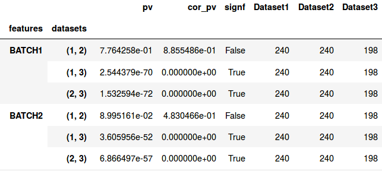
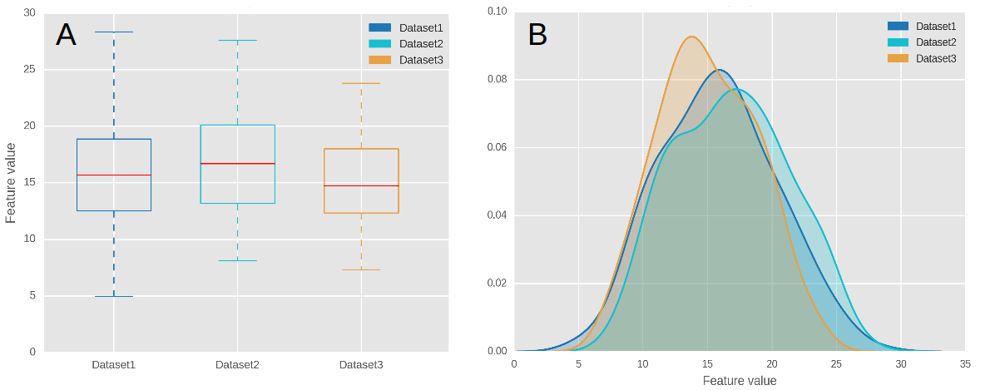
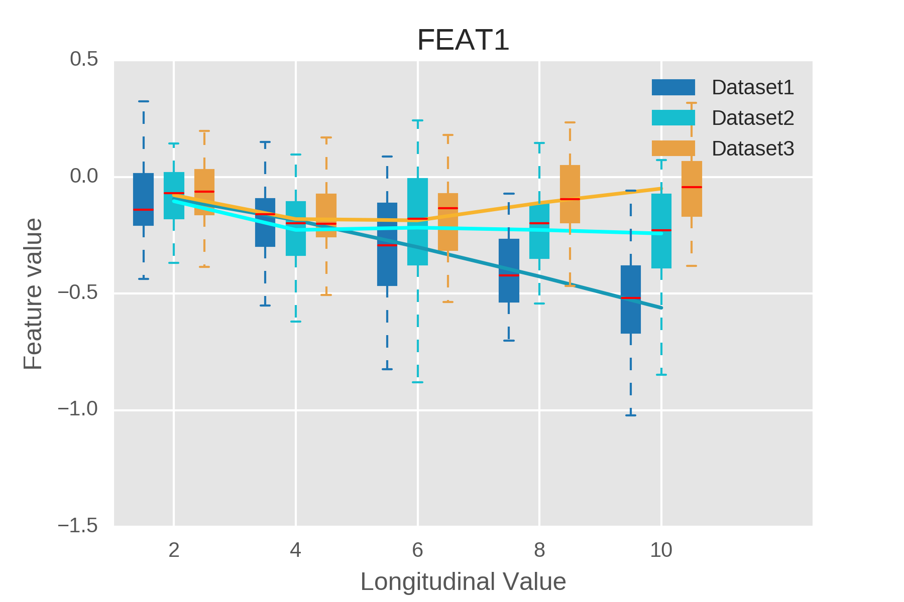

Exemplary Results
=================

Statistical Comparison Result-Table
-----------------------------------

Cross-sectional Comparison
~~~~~~~~~~~~~~~~~~~~~~~~~~

The index (rows) of the result table consists of the feature name on the outer level and the dataset combination used in \
the respective comparison as second level index.
FEATURE1 (1, 2) hereby declares that this row represents the comparison of FEATURE1 between dataset 1 and 2,\
where 1 and 2 point to the position of the respective dataset in the DataCollection.

The result table of a feature comparison lists in the columns:

- The p-values
- The familywise error corrected p-values
- A boolean indicator if the test result was significant (a significance level alpha of 0.05 is assumed)
- One column per dataset listing the number of observations available for the comparison of that feature

The above figure shows the visualization of data as a boxplot (A) and a comparative kernel density estimate plot (B).

Longitudinal Comparison
~~~~~~~~~~~~~~~~~~~~~~~

.. image:: longresult.png

Like for the cross-sectional comparison the table is indexed using multiple layers. The first and third index refer \
again to the feature name and the datasets being compared, respectively. The second layer gives information on the \
longitudinal dimension. It lists the time point at which the corresponding statistical tests have been performed.

This figure depicts a visualization of the progression of a feature over multiple longitudinal steps.

Clustering
----------

The confusion matrix of the hierarchical clustering lists the datasets as rows and clusters as columns.
Each cell represents the number of entities of that dataset being assign to the cluster.