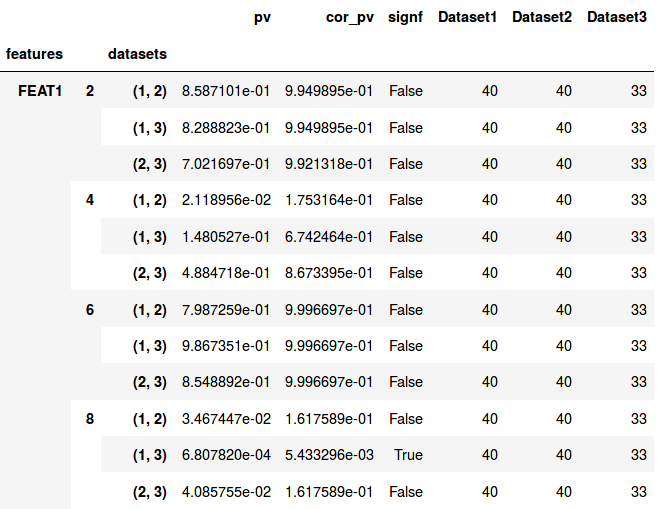

Interpret Results
=================

Statistical Comparison Result-Table
-----------------------------------

Cross-sectional Comparison
~~~~~~~~~~~~~~~~~~~~~~~~~~
.. image:: resulttable.png

The index (rows) of the result table consists of the feature name on the outer level and the dataset combination used \
for the comparison as second level index.
FEATURE1 (1, 2) means, that this row represents the comparison of FEATURE1 between dataset 1 and 2, where 1 and 2 \
points to the position in the DataCollection.

The result table of a feature comparison lists in the columns:
- the p-values
- the familywise error corrected p-values
- a boolean if the test resutl was statistically significant
- one column for each dataframe listing the number of observations for that feature

Longitudinal Comparison
~~~~~~~~~~~~~~~~~~~~~~~

Like for the cross-sectional comparison the table is indexed using multiple layers. The first and third index are again
the feature name and the datasets being compared, respectively. The second layer gives information on the time point. It
lists the time point for which the corresponding statistical tests have been performed.
